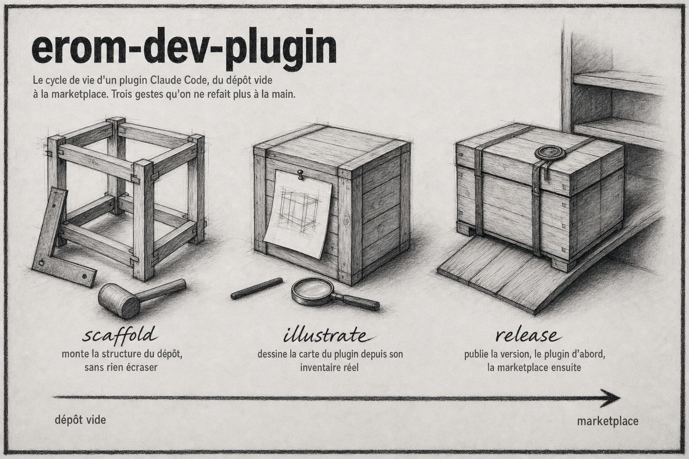

# erom-dev-plugin

Le cycle de vie d'un plugin Claude Code eRom, du dépôt vide à la marketplace.
Trois gestes qu'on ne refait plus à la main : scaffolder le dépôt, dessiner sa
carte de présentation, publier une version.

## Installation

```
/plugin marketplace add eRom/erom-marketplace
/plugin install erom-dev-plugin@erom-marketplace
```

## Les skills

| Skill | Invocation | Ce qu'elle fait |
|---|---|---|
| `scaffold` | `/erom-dev-plugin:scaffold` | Monte la structure d'un dépôt de plugin : manifeste rempli avec le vrai repo, contrat de dépôt, arborescence `plugin/`. |
| `illustrate` | `/erom-dev-plugin:illustrate` | Dessine la carte de présentation du plugin au fusain, depuis son inventaire réel. |
| `release` | `/erom-dev-plugin:release` | Publie une version : bump SemVer, deux dépôts, deux commits, vérification de la CI. |

Les trois sont des commandes explicites : elles ne se déclenchent jamais toutes
seules, il faut les appeler.

### scaffold

Part d'un dossier déjà créé et onboardé, et y écrit sept fichiers et trois
dossiers : `.gitignore`, le contrat de dépôt, les deux README, le manifeste, la
licence et un placeholder d'illustration, puis `assets/`, `docs/` et
`plugin/skills/`.

Le nom du plugin n'est pas le nom du dépôt : le dépôt garde le préfixe
`erom-agence-`, le plugin s'appelle `erom-<nom>`. La skill le déduit, l'annonce,
et laisse corriger.

Idempotente : elle n'écrase jamais un fichier existant et annonce ce qu'elle
laisse en place. La relancer après coup est sans danger.

### illustrate

Produit une planche au fusain en 1536x1024, format paysage, destinée au README du
dépôt. Le style est figé et validé ; c'est le contenu qui se travaille.

Tout ce qui s'affiche sur la carte vient de l'inventaire réel du plugin, lu par
`claude plugin details` : les skills étiquetées sur le dessin, les chiffres du bas,
le tableau de la stack. Un composant qui n'est pas chargé ne va pas sur la carte.

L'image en tête de ce README a été produite par cette skill, sur ce plugin.

### release

Deux dépôts, deux commits, toujours dans le même ordre : le plugin d'abord, la
marketplace ensuite. L'entrée marketplace pointe `ref: main` sur le dépôt du
plugin ; annoncer une version dont le code n'est pas encore poussé ferait
installer autre chose que ce qui est déclaré.

Un préflight compare la version des deux côtés et rejoue les assertions de la CI
avant chaque push. Il refuse de valider tant que les versions divergent, ce qui
est précisément l'erreur silencieuse qu'il existe pour attraper.

Sur une première publication, la skill s'arrête et demande : l'entrée à créer
réclame une description, une source et un choix de `strict`.

## Prérequis

| Skill | Ce qu'il faut |
|---|---|
| `scaffold` | Un dossier avec un remote `origin`. `caserne onboard` en amont si le projet doit avoir son Linear et son Slack. |
| `illustrate` | Le plugin `erom-image` installé et actif, et `OPENAI_API_KEY` dans l'environnement. |
| `release` | `uv` pour le préflight, `gh` pour la vérification de CI, et une copie locale de `erom-marketplace` dans `~/dev/`. |

## Licence

MIT, Romain Ecarnot.
